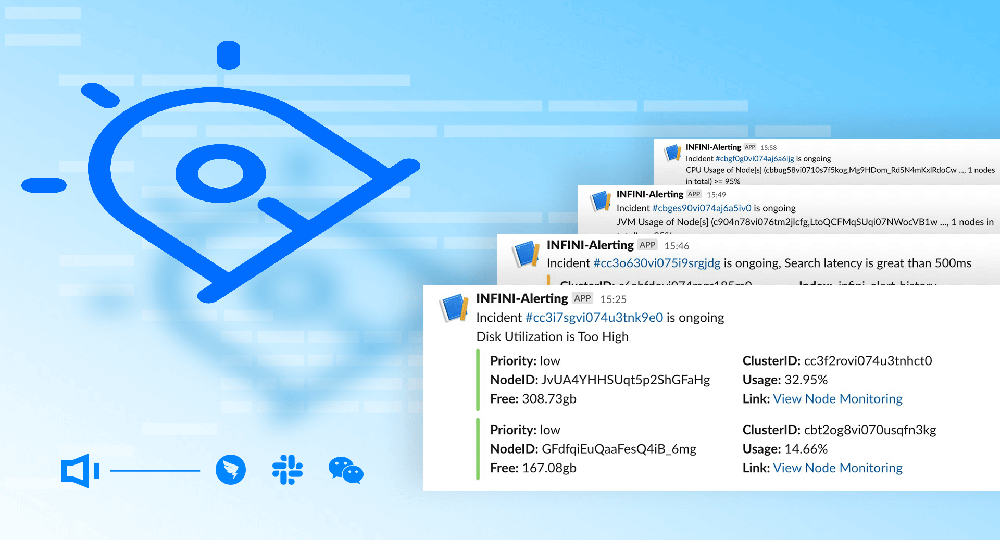

# INFINI Examples 

## Alerting Rules for INFINI Console

- [Cluster Health Change to Red](./Console/Alerting-rules/Cluster-Health-Change-to-Red.md)
- [Index Health Change to Red](./Console/Alerting-rules/Index-Health-Change-to-Red.md)
- [Disk utilization is Too High](./Console/Alerting-rules/Disk-Utilization-is-Too-High.md)
- [CPU utilization is Too High](./Console/Alerting-rules/CPU-Utilization-is-Too-High.md)
- [JVM utilization is Too High](./Console/Alerting-rules/JVM-Utilization-is-Too-High.md)
- [Shard Storage >= 55G](./Console/Alerting-rules/Shard-Storage-gte-55G.md)
- [Elasticsearch node left cluster](./Console/Alerting-rules/Elasticsearch-Node-Left-Cluster.md)
- [Search latency is great than 500ms](./Console/Alerting-rules/Search-Latency-gte-500ms.md)
- [Too Many Deleted Documents](./Console/Alerting-rules/Too-Many-Deleted-Documents.md)

For more details, please visit https://console.infinilabs.com/

## Springboot 3.x for INFINI Easysearch

[Springboot 3.x for Easysearch example](Easysearch/ezsboot/README.md)

for more information, please join the Wechat / Discord channel for discussion.
